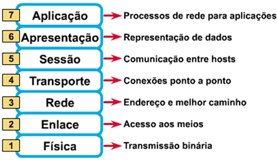

<h1 align="center">Ambientes Computacionais e Segurança</h1>

## Camadas de Rede em Comunicação

## Endereço IPv4

É o endereço lógico, é atribuido a uma interface logicamente, ele não faz parte da interface como um endereço MAC

### Classes

- **A** -> 001 a 127 . X . Y . Z
- **B** -> 128 a 191 . X . Y . Z
- **C** -> 192 a 223 . X . Y . Z
- **D** -> 224 a 239 . X . Y . Z
- **E** -> 240 a 255 . X . Y . Z
