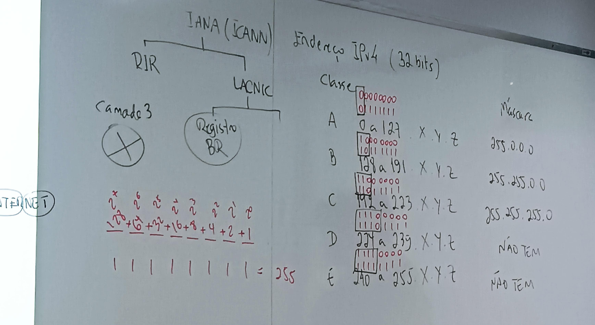

<h1 align="center">Ambientes Computacionais e Segurança</h1>

## Camadas de Rede em Comunicação

## Endereço IPv4

É o endereço lógico, é atribuido a uma interface logicamente, ele não faz parte da interface como um endereço MAC

### Classes do IP

| Classe | Máscara | hosts |
|--------|---------|-------|
| **A** -> 1 a 127 . X . Y . Z | 255.0.0.0 | 16.777.214 |
| **B** -> 128 a 191 . X . Y . Z | 255.255.0.0 | 65.534 |
| **C** -> 192 a 223 . X . Y . Z | 255.255.255.0 | 254 |
| **D** -> 224 a 239 . X . Y . Z | 255.255.255.255 | 0 |
| **E** -> 240 a 255 . X . Y . Z | 0 | 0 |

Classe A: rede 10.X.Y.Z não trafega na internet
Classe B: rede 172.16 à 172.31 não trafega na internet
Classe B: 169.254 

### Calculo para achar o número de hosts

`2^números-de-zeros-da-máscara - 2`

### Como descobrir a rede de uma máquina

200.232.60.189 / 27 | Ip 

200.232.060.10111101 | Ip transformado pro binário

255.255.255.11100000 | Máscara

---

200.232.060.10100000 = 200.232.060.160

- Inicial = 161
- Final = 190
- Broadcast = 191

### Exercício

**A)** 21.21.21.181 / 26

021.021.021.10110101
255.255.255.11000000 = 2^6
---
021.021.021.10000000 =
021.021.021.128 

- Inicial = 129
- Final = 190
- Broadcast = 191

**B)** 179.179.179.179 / 27

179.179.179.10110011
255.255.255.11100000 = 2^5
---
179.179.179.10100000 =
179.179.179.160

- Inicial = 161
- Final = 190
- Broadcast = 191
